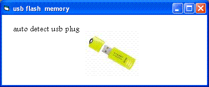



## Auto detect USB FLASH MEMORY plug in

### Description

DETECT USB FLASH MEMORY PLUG IN OR PLUG OUT
 
### More Info
 

             |
---                |---
**Submitted On**   |2007-01-29 06:30:02
**By**             |[muad &amp; feroo](https://github.com/Planet-Source-Code/PSCIndex/blob/master/ByAuthor/muad-amp-feroo.md)
**Level**          |Beginner
**User Rating**    |4.8 (29 globes from 6 users)
**Compatibility**  |VB 5\.0, VB 6\.0
**Category**       |[Coding Standards](https://github.com/Planet-Source-Code/PSCIndex/blob/master/ByCategory/coding-standards__1-43.md)
**World**          |[Visual Basic](https://github.com/Planet-Source-Code/PSCIndex/blob/master/ByWorld/visual-basic.md)
**Archive File**   |[Auto\_detec2045261292007\.zip](https://github.com/Planet-Source-Code/muad-amp-feroo-auto-detect-usb-flash-memory-plug-in__1-67754/archive/master.zip)

